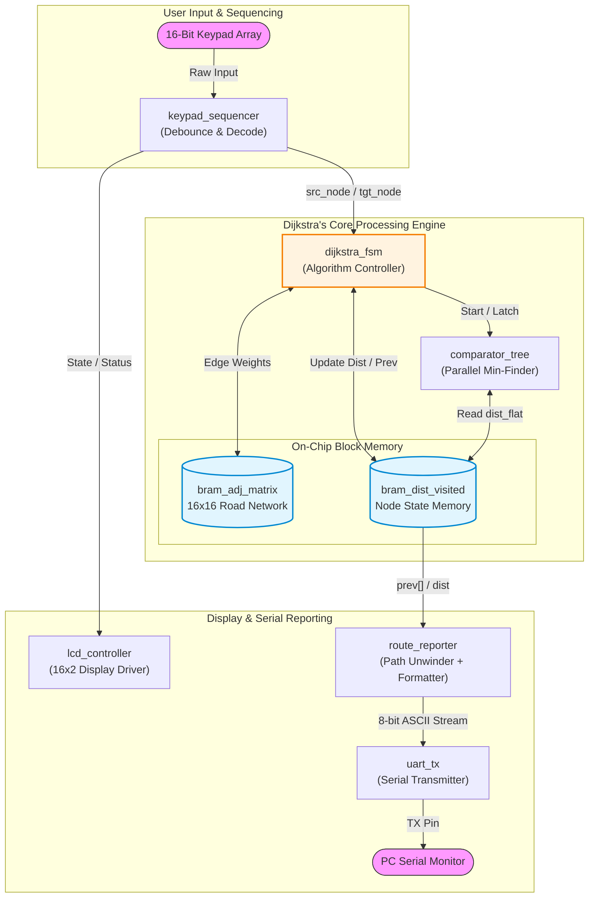

# FPGA Implementation of Dijkstra's Shortest Path Algorithm

A hardware implementation of **Dijkstra's Shortest Path Algorithm** using **Verilog HDL** on a **AT-STLN-ARTIX 7-001 FPGA Development Board**. The system computes the shortest path between user-selected nodes and visualizes the result through a **Python-based interactive web application**.

---

## 📌 Project Overview

This project implements **Dijkstra's Shortest Path Algorithm** entirely in hardware using **Verilog HDL** on a **AT-STLN-ARTIX 7-001 FPGA Development Board**. The weighted graph is stored in Block RAM (BRAM), and the shortest path is computed using a dedicated Finite State Machine (FSM).

The source and destination nodes are selected using a **4×4 matrix keypad** connected to the FPGA. Once the computation is complete, the FPGA transmits the result to a **Python web application**, which displays the shortest route on an interactive map along with the total distance and computation time.

This project demonstrates the integration of **digital hardware design**, **serial communication**, and **software visualization** to create a complete hardware-accelerated pathfinding system.

---

## ✨ Features

- Hardware implementation of Dijkstra's Algorithm
- Verilog HDL based modular architecture
- AT-STLN-ARTIX 7-001 FPGA implementation
- 4×4 Matrix Keypad user input
- BRAM-based graph storage
- FSM-controlled shortest path computation
- UART communication between FPGA and host computer
- Python-based interactive web application
- Real-time route visualization
- Displays shortest path, total distance, and computation time

---

## 🛠 Hardware Platform

- AT-STLN-ARTIX 7-001 FPGA Development Board
- 4×4 Matrix Keypad
- FTDI USB-UART Interface
- Host Computer

---

## 💻 Software & Tools

- Verilog HDL
- Xilinx Vivado
- Python 3
- Pygame
- PySerial

---

## 🏛️ Design and Architecture

### System Architecture
The design is structured as a decoupled control-data-path system. Top-level integration manages the flow of data between the user input sequencer, the core algorithmic solver (FSM + Comparator Tree), and external display/serial reporting peripherals.

---

## ⚙ Implementation Approach

The weighted road network is stored as an adjacency matrix in on-chip Block RAM (BRAM). After the user selects the source and destination nodes through the 4×4 matrix keypad, the keypad sequencer decodes the input and forwards it to the Dijkstra FSM.

The FSM initializes the node data and repeatedly selects the minimum unvisited node using comparator logic. Neighboring edge weights are read from BRAM, distances are updated whenever a shorter path is found, and predecessor information is stored for route reconstruction.

Once the destination node is reached, the reconstructed shortest path is transmitted via UART to a Python application. Using PySerial and Pygame, the application visualizes the computed route on an interactive map while displaying the total distance and hardware computation time.

---

## 📂 Module Description

| Module | Description |
|---------|-------------|
| **top.v** | Top-level module integrating all project components. |
| **dijkstra_fsm.v** | Controls the execution of Dijkstra's Algorithm. |
| **bram_adj_matrix.v** | Stores the weighted graph as an adjacency matrix. |
| **bram_dist_visited.v** | Stores distance, visited, and predecessor information. |
| **comparator.v** | Finds the minimum unvisited node during each iteration. |
| **keypad_sequencer.v** | Processes keypad input and generates source and destination nodes. |
| **display_no.v** | Converts keypad input into graph node numbers. |
| **route_reporter.v** | Reconstructs the shortest route from predecessor information. |
| **uart_tx.v** | Transmits computed route data to the Python application. |
| **lcd_controller.v** | Controls LCD status messages during execution. |
| **bin2bcd.v** | Converts binary values to BCD format for display. |

---

## 🔄 System Workflow

1. User selects the source node using the 4×4 keypad.
2. User selects the destination node.
3. The graph stored in BRAM is initialized.
4. The Dijkstra FSM computes the shortest path.
5. Distance and predecessor values are updated.
6. The final route is reconstructed.
7. The computed path is transmitted through UART.
8. The Python web application receives the route data.
9. The shortest path is displayed on an interactive map together with the total distance and computation time.

---

## 📊 Results

The proposed hardware accelerator was successfully implemented and verified on the AT-STLN-ARTIX 7-001 FPGA Development Board. The design correctly computes the shortest path between multiple source and destination node combinations entered through the 4×4 matrix keypad.

The FPGA transmits the computed route to a Python-based visualization interface, which displays the shortest path on an interactive map together with the total travel distance and execution time. The successful integration of FPGA hardware and software visualization demonstrates the correctness and efficiency of the proposed implementation.

---

## 🚀 Future Improvements

- Support larger road networks
- Dynamic graph loading
- GPS integration
- Live traffic updates
- Wireless communication
- Mobile application support

---

## 👨‍💻 Authors

Developed as an FPGA-based implementation of **Dijkstra's Shortest Path Algorithm** using **Verilog HDL**, integrating hardware computation with a Python-based web application for interactive route visualization.
